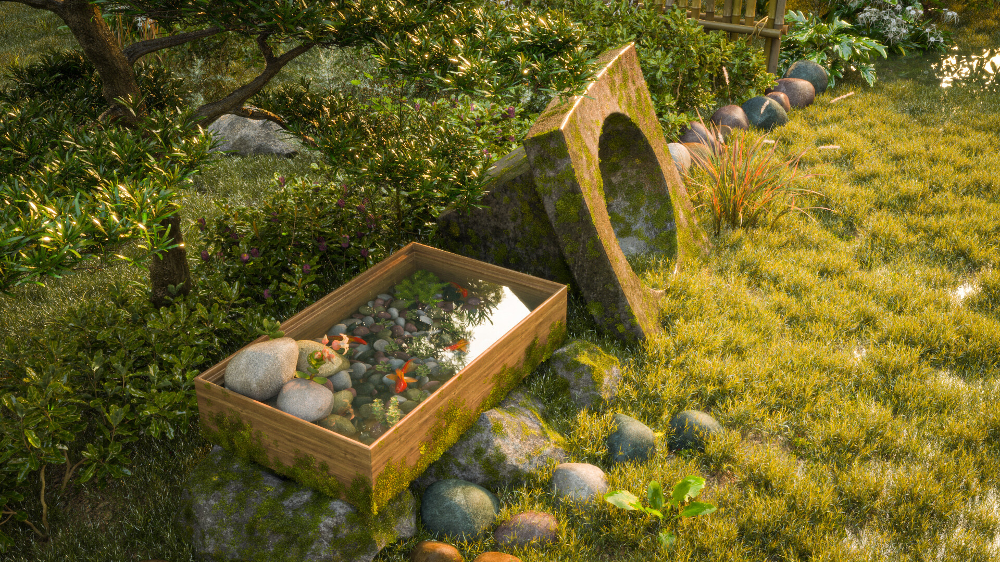
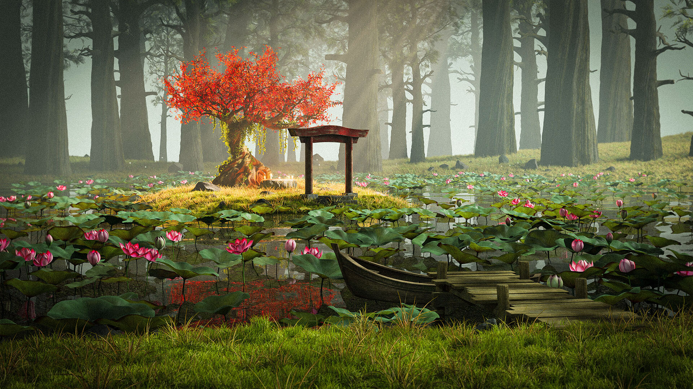
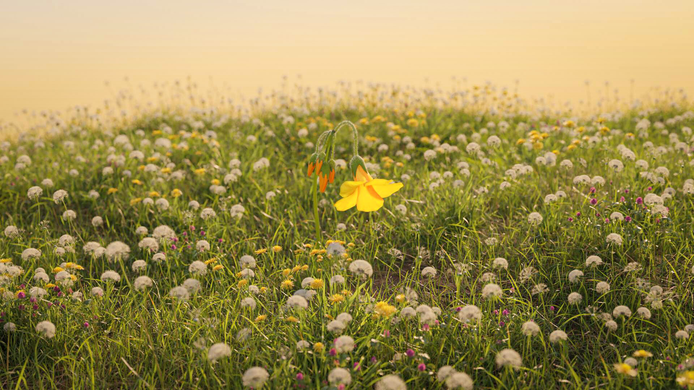

> Tôi đã tham gia vào việc tạo dựng các dự án môi trường 3D, từ việc mô phỏng không gian thiên nhiên đến cấu trúc đô thị. Qua công việc này, tôi học hỏi được nhiều về việc tạo ra các không gian sống động và thú vị. Những dự án này giúp tôi cải thiện kỹ năng và hiểu biết về mô hình hóa 3D, cũng như phát triển khả năng áp dụng các kỹ thuật mới và sáng tạo trong việc thiết kế.

