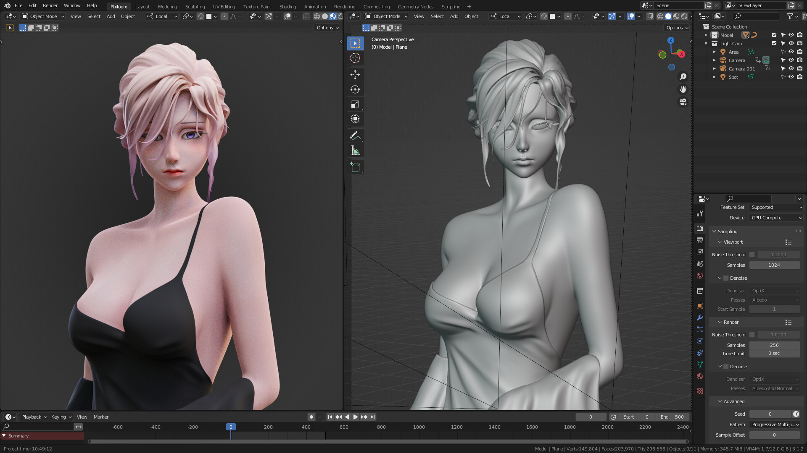
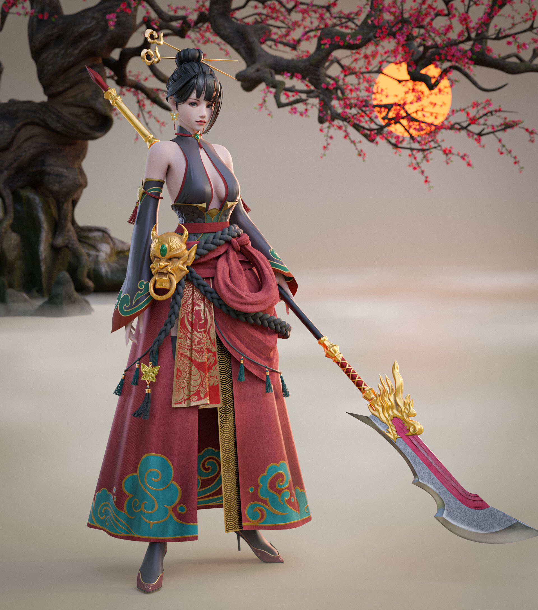
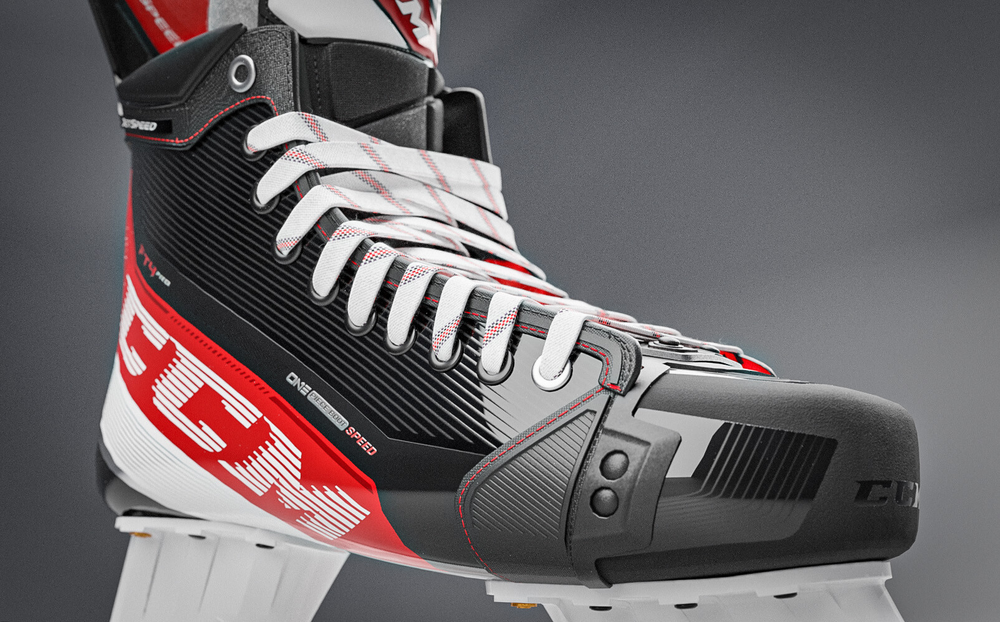
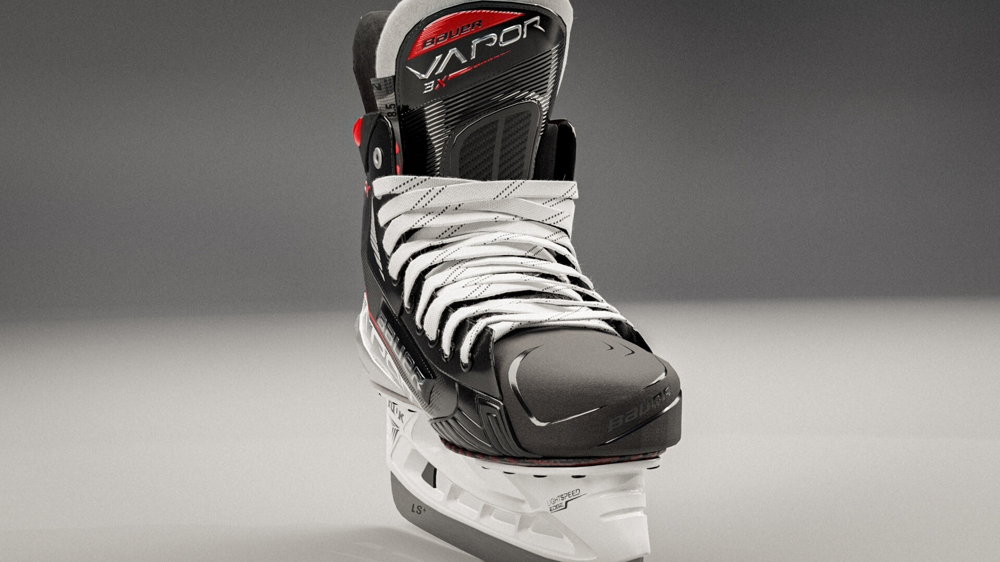
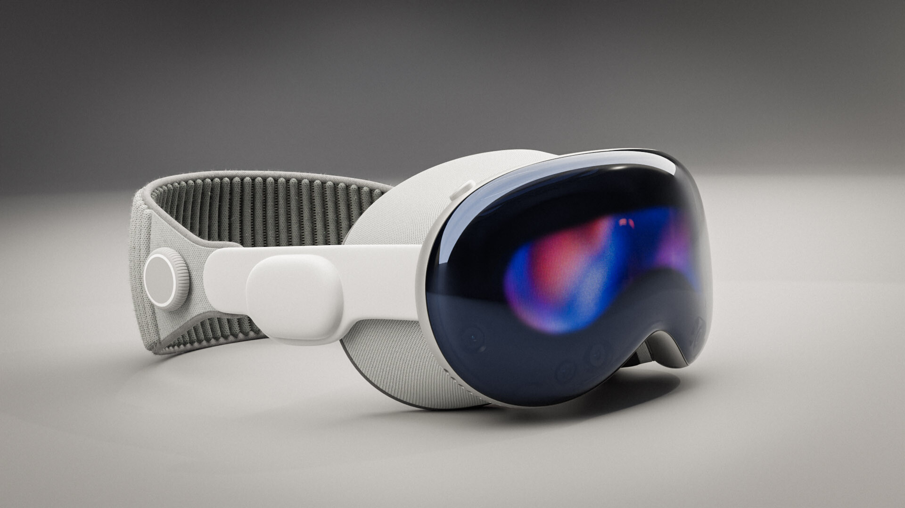
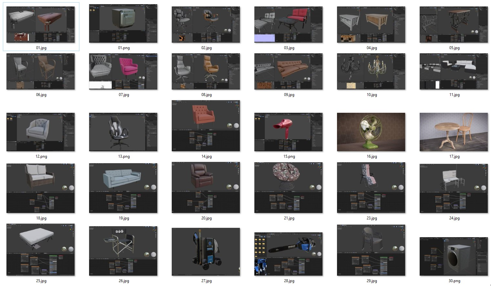
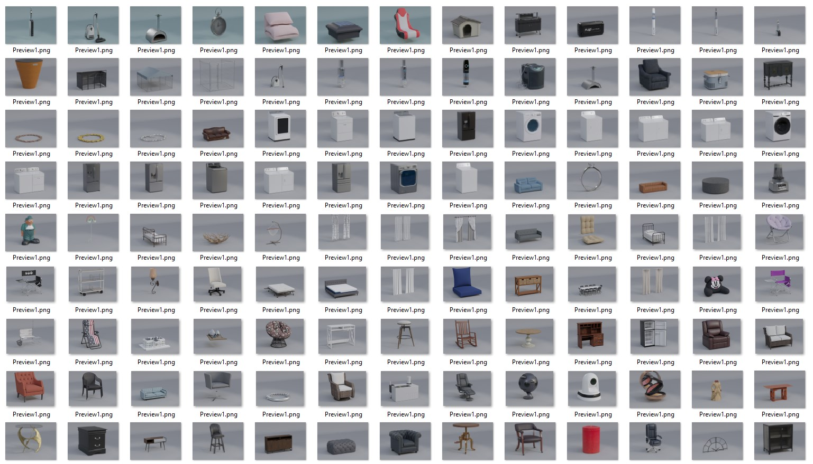
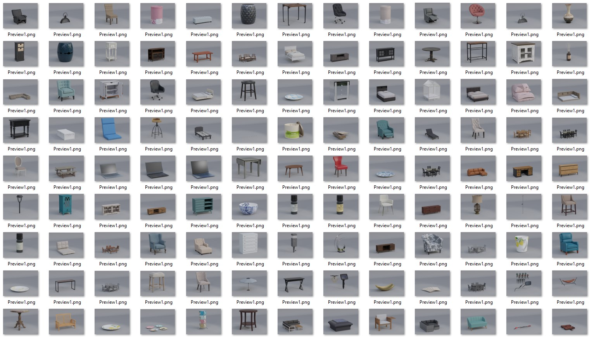
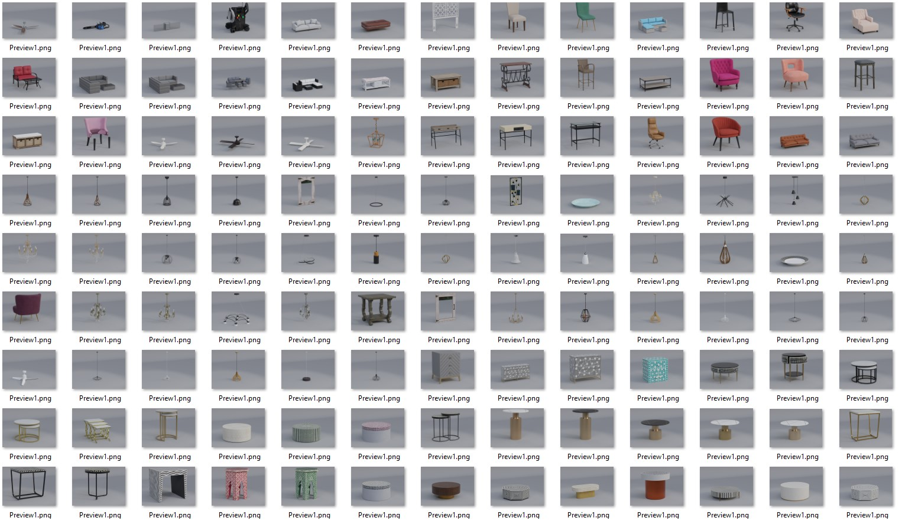
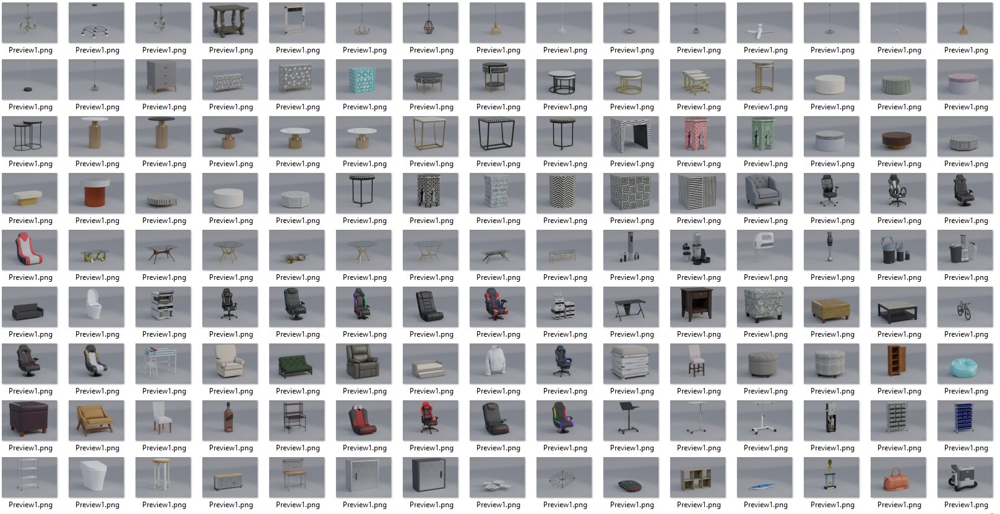

## Mô Hình Nhân Vật (Character Models):
>  Với niềm đam mê dành cho việc tạo hình và khắc họa nhân vật, tôi đã tạo ra một loạt các mô hình nhân vật 3D chi tiết cao và sắc nét

## Mô Hình Sản Phẩm Chất Lượng Cao
> Mô hình hóa sản phẩm với chất lượng cao yêu cầu sự chú trọng tới chi tiết và độ chính xác. Dựng từ đồ dùng gia đình cho tới thiết bị kỹ thuật số phức tạp, mô hình của tôi đảm bảo tính thẩm mỹ lẫn kỹ thuật, phục vụ cho cả quảng cáo sản phẩm và cho game.

## Dự Án Modeling Sản Phẩm Đa Dạng
> Các dự án modeling sản phẩm của tôi phản ánh một dải rộng các ngành hàng từ nội thất đến thiết bị điện tử, phụ kiện thời trang và hơn thế nữa. Mỗi dự án là một sự kết hợp của kỹ thuật, và công nghệ, với kết quả là các mô hình đẹp mắt có khả năng thể hiện đúng tinh thần và chất lượng của sản phẩm thực tế.

## Mô Hình 3D cho Ứng Dụng VR 
> Trong lĩnh vực phát triển nhanh chóng của thực tế ảo, tôi đã tạo ra mô hình 3D phong phú, sẵn sàng để tích hợp vào môi trường VR. Mỗi mô hình được tối ưu để mang lại hiệu năng cao và chất lượng hình ảnh chân thực nhất khi được trải nghiệm thực tế ảo.

